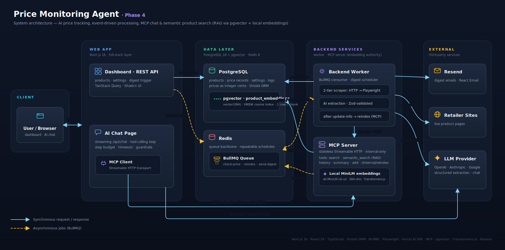

# Price Monitor AI Agent

Price Monitor AI Agent is a full-stack portfolio project that tracks product prices from arbitrary URLs, stores historical price records, and sends automated digest emails with trend analysis.

The core engineering problem is extraction reliability. Instead of using AI as the first step, the worker starts with a fast HTML parser and only escalates to browser automation and AI-powered structured extraction when a page is dynamic, bot-protected, or poorly structured.

**Live demo**  
https://price-monitor.onlineeric.net/

## What this project demonstrates



- Full-stack application design with Next.js 16, React 19, TypeScript, PostgreSQL, Redis, and BullMQ
- Practical AI integration using the Vercel AI SDK with typed structured output, not just free-form prompting
- Conversational AI agent with tool calling over a custom Model Context Protocol (MCP) server, streaming UI, and multi-turn chat history
- Background job orchestration for price checks, digest generation, and scheduler-managed repeatable jobs
- Browser automation with Playwright Extra and stealth mode for difficult e-commerce pages
- Production-oriented operations including Dockerized services, health endpoints, CI/CD, and self-hosted deployment

## Product capabilities

- Add a product URL and immediately enqueue an initial price check
- Manage products with create, edit, delete, active/inactive state, and manual re-check actions
- Browse monitored products in card or table views with recent price history
- Use global product search to quickly locate and edit products from anywhere in the dashboard
- Chat with an AI agent that can search products, summarize price trends, retrieve history, and add new products through MCP tool calls
- Configure daily or weekly email digest schedules from the UI
- Trigger a full "check all products and send digest" run manually from the dashboard
- Track historical prices and compare current price vs last check and 7/30/90/180 day averages

## How the system works

```text
Next.js dashboard + API routes
        |
        v
BullMQ queue on Redis
        |
        v
Node worker
  - HTML fetch + Cheerio
  - Playwright + stealth
  - AI structured extraction fallback
        |
        v
PostgreSQL price history
        |
        v
Resend email digests
```

### End-to-end flow

1. A user adds a product URL in the web app.
2. The Next.js API stores the product and enqueues a `check-price` job.
3. The worker attempts extraction in tiers:
   - Tier 1: direct HTTP fetch plus Cheerio selectors
   - Tier 2: Playwright-rendered page plus selector extraction
   - Tier 3: AI extraction with typed Zod validation if selectors still fail
4. The latest result is stored in PostgreSQL as a new price record.
5. Scheduled or manual digest jobs fan out price checks for all active products, calculate trends, and send a summary email.

## AI extraction pipeline

This repository uses AI where it adds clear value: as a fallback for difficult pages, not as the default for every request.

- **Fast path:** `fetch()` + Cheerio handles simple product pages cheaply and quickly.
- **Rendered fallback:** Playwright loads JavaScript-heavy pages, waits for DOM stability, and retries extraction with browser-side selectors.
- **AI fallback:** Vercel AI SDK `generateObject()` extracts `title`, `price`, `currency`, and `imageUrl` into a strict Zod schema.
- **Provider flexibility:** OpenAI, Anthropic, and Google providers are switchable through environment variables.
- **Operational detail:** the worker reuses a singleton browser instance and exposes a health server for deployment checks.

## AI chat agent with MCP

A dedicated `/dashboard/chat` page lets users talk to the price monitor in natural language. The chat page streams responses from `/api/chat`, which invokes a custom Model Context Protocol (MCP) server to read and write the same database the dashboard uses. The AI agent has no SQL access, only the typed tools below.

```text
Browser (chat UI, streamed)
        |
        v
Next.js /api/chat  (Vercel AI SDK streamText, multi-step tool calls)
        |
        v
MCP client  --->  apps/mcp-server  (typed tools, Zod-validated)
 (HTTP / stdio)            |
                          v
                  PostgreSQL  +  BullMQ queue
```

- **Custom MCP server (`apps/mcp-server/`):** standalone Node process using `@modelcontextprotocol/sdk`, speaking two transports selected by `MCP_TRANSPORT` — stateless Streamable HTTP (web → mcp-server in Docker dev and production) and stdio (spawned by the IDE for local tool inspection). Tools: `search_products`, `get_product_history`, `get_price_summary`, and `add_product` (which enqueues a `check-price` BullMQ job, reusing the existing extraction pipeline). All tool inputs are Zod schemas; failures are wrapped into a structured `{ error: { code, message } }` shape.
- **Streaming chat API:** `apps/web/src/app/api/chat/route.ts` runs on the Node runtime, bridges live MCP tools into AI SDK `tool()` instances, enforces a 5-step tool budget and 60-second per-turn timeout, and returns the AI SDK v6 UI-message protocol with a structured error taxonomy (`validation_error`, `provider_config_missing`, `mcp_unreachable`, `step_budget_exceeded`, `turn_timeout`, `empty_response`, `provider_error`).
- **Provider abstraction:** the same `AI_PROVIDER` env var that drives the worker's extraction fallback (`openai` | `anthropic` | `google`) selects the chat model.
- **Multi-turn UI:** Zustand-backed in-memory chat state, sanitized markdown rendering via `streamdown`, and inline tool-call indicators that show which tool ran, the arguments, and the result for demo transparency.
- **Domain guardrail:** the system prompt restricts the agent to product / price / monitor topics so it politely declines off-topic requests.
- **Transport selection:** the web MCP client (`apps/web/src/lib/mcp/client.ts`) picks `StreamableHTTPClientTransport` when `MCP_HTTP_URL` is set (production and Docker dev), otherwise falls back to spawning the server over stdio for the IDE workflow.
- **Local dev:** the same MCP server is registered in VSCode/Cursor, so the tools can be inspected with `npx @modelcontextprotocol/inspector` or driven directly from the IDE.

## Tech stack

| Area | Technologies |
| --- | --- |
| Web app | Next.js 16 App Router, React 19, TypeScript |
| UI | Tailwind CSS v4, Shadcn UI, Radix primitives, Sonner, Lucide |
| Forms and validation | React Hook Form, Zod |
| Data access | Drizzle ORM, PostgreSQL 18 |
| Queue and background jobs | BullMQ, Redis 8 |
| Extraction | Cheerio, Playwright, Playwright Extra, `puppeteer-extra-plugin-stealth` |
| AI | Vercel AI SDK, OpenAI, Anthropic, Google, `@modelcontextprotocol/sdk`, `streamdown` |
| Email | Resend, React Email |
| Testing | Vitest, Testing Library, jsdom |
| DevOps | Docker Compose, GitHub Actions, GHCR, Coolify |

## Engineering details worth noting

- **Worker-managed scheduling:** one worker instance owns BullMQ repeatable jobs, avoiding external cron dependencies.
- **Digest orchestration:** digest runs create child `check-price` jobs for each active product, then send the email after all checks complete.
- **Health monitoring:** the web app exposes `/api/health`, and the worker exposes its own `/health` endpoint plus a proxied web route.
- **Typed persistence:** products, price records, run logs, and settings are defined in a shared Drizzle schema package.
- **Recent UI improvements:** the dashboard includes shared product create/edit flows and global search for faster product management.

## Local development

### Prerequisites

- Node.js 20+
- pnpm
- Docker

### Quick start

```bash
pnpm install
cp .env.example .env
# configure at least one AI provider key; add Resend settings for digest emails
pnpm docker:up
pnpm --filter @price-monitor/db migrate   # apply committed migrations (see below)
pnpm worker:up
pnpm --filter @price-monitor/web dev
```

Open `http://localhost:3000/dashboard`.

### Database migrations

Schema changes ship as **versioned, committed Drizzle migrations** (the
canonical path); `drizzle-kit push` is kept only for quick local prototyping.

```bash
pnpm --filter @price-monitor/db generate   # author: diff schema.ts → drizzle/NNNN_*.sql (commit it)
pnpm --filter @price-monitor/db migrate     # apply pending migrations (idempotent, journalled)
```

In production the single gated worker (`RUN_MIGRATIONS=true`, the same instance
that owns `ENABLE_SCHEDULER=true`) auto-applies pending migrations on startup,
before it consumes any jobs. See [Database migrations](docs/migrations.md) for
the full workflow, the `IF NOT EXISTS` baseline, and the manual fallback.

### Development worker

If you want the worker in local watch mode instead of Docker:

```bash
pnpm --filter @price-monitor/worker exec playwright install chromium
pnpm worker:dev          # from repo root
# or equivalently:
cd apps/worker && pnpm dev
```

Both commands route through `scripts/dev-worker.sh`: temporarily stop the Docker worker, run the worker with `tsx watch`, then restore the Docker worker when you exit (Ctrl+C).

### Rebuilding the Docker worker image

After changing worker source code or dependencies, rebuild and restart the Docker worker:

```bash
pnpm worker:up    # rebuilds image (--build) and starts container
pnpm worker:down  # stop without rebuild
```

### Lint and tests

Lint and tests run across all workspaces from the repository root:

```bash
pnpm lint          # Biome lint over web, worker, mcp-server, packages, scripts
pnpm lint:fix      # apply Biome's safe + unsafe fixes (always review the diff)
pnpm test          # vitest run in every workspace that has a `test` script
```

Tests live alongside the code they cover (e.g. `src/lib/format.ts` →
`src/lib/format.test.ts`). The web workspace also has integration-flavoured
tests under `src/test/` for the dashboard pages and API routes.

The test suite is intentionally **not** wired into CI — it is meant to be run
locally before pushing. Whenever you change application code, also add or
update a colocated `*.test.ts` (or `*.test.tsx`) and run `pnpm test` to
confirm nothing regressed.

## Deployment

Deployment is automated through GitHub Actions and Coolify.

- Pushes to `dev` build `web:dev` and `worker:dev` images for CI validation.
- Pushes to `main` build `web:latest` and `worker:latest`, push them to GHCR, and trigger Coolify webhooks.
- The production setup runs three independent containers — `web`, `worker`, and the internal-only `mcp-server` — on the same Docker network, plus PostgreSQL and Redis.
- Only one production worker should have `ENABLE_SCHEDULER=true` to avoid duplicate scheduled emails. That same single worker also sets `RUN_MIGRATIONS=true` so it auto-applies pending DB migrations on startup before consuming jobs (see [Database migrations](docs/migrations.md)).

## Repository structure

```text
apps/
  web/         Next.js dashboard, chat page, REST + streaming API routes
  worker/      BullMQ worker, extraction pipeline, scheduler, email jobs
  mcp-server/  Custom MCP server exposing typed tools to the AI chat agent
packages/
  db/          Shared Drizzle schema and database client
docs/          Deployment and environment notes
specs/         Planning and implementation artifacts
scripts/       Local development and utility scripts
```

## Good entry points for technical review

- `apps/worker/src/services/scraper.ts`
- `apps/worker/src/services/playwrightFetcher.ts`
- `apps/worker/src/services/aiExtractor.ts`
- `apps/worker/src/jobs/sendDigest.ts`
- `apps/worker/src/scheduler.ts`
- `apps/web/src/app/api/products/route.ts`
- `apps/web/src/app/api/chat/route.ts`
- `apps/web/src/app/(main)/dashboard/products`
- `apps/web/src/app/(main)/dashboard/chat`
- `apps/web/src/lib/mcp/client.ts`
- `apps/web/src/lib/ai/chat-tools.ts`
- `apps/mcp-server/src/index.ts`
- `apps/mcp-server/src/tools`
- `packages/db/src/schema.ts`
- `.github/workflows/build-and-push.yml`

## Additional documentation

- [Production environment reference](docs/production-env.md)
- [Database migrations](docs/migrations.md)
- [Docker troubleshooting](docs/troubleshooting-docker.md)
